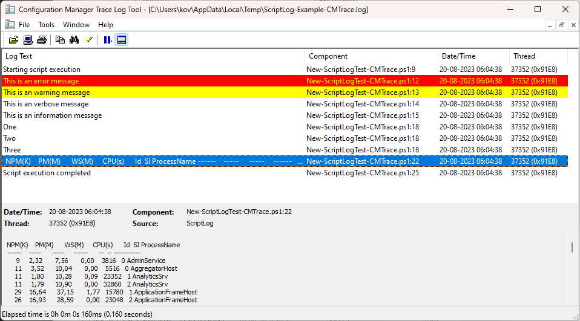

# ScriptLog module 

A module providing consistent and rich logging for your PowerShell scripts.

## Features

* Send log messages to files or keep them in memory for manual processing.
* Select the severity of the log message: Information, Verbose, Warning and Error.
* Choose which severity of log messages should be shown on the console.
* Have a datetime appended to your log file name to generate a unique log file each time a script is executed.  
* Create multiple log targets at the same time, and send some log messages to one log and some messages to another log. This can be used for creating a log with general runtime information, and one with debug information.

## Log formats

The module supports logging in the following ways:

* Streamed to a log files in the CMTrace format (used by System Center Configuration Manager). The advantage of this format is that a log entry can contain multiple lines, and warnings and errors are highlighted automatically.

  
  
  *Example of CMTrace output*

* Saved in memory for manual processing. This is useful when running in environment without consistant storage for streaming log files, like Azure Automation or similar.

It is planned to add additional file formats (CSV, ect) over time.

## Installation

Installation options can be found at https://www.powershellgallery.com/packages/ScriptLog

## Examples

### Initializing a log

Before writing to a log for the first time, it must be initialized.

#### A simple log file
~~~ powershell
New-ScriptLog
~~~ 
Create a new ScriptLog object with default settings. File will be created in the temp folder, with the name ScriptLog.log and will be written in the CMTrace format. If this is the first ScriptLog object created in the PowerShell session, this will be the default ScriptLog as well.

#### Logging to memory with console output
~~~powershell
New-ScriptLog -Name "MemoryLog" -LogType Memory -MessagesOnConsole @("Error","Verbose")
~~~
Create an in-memory ScriptLog object to allow for collection of log messages during runtime. Only errors and verbose messages will be written to the console. Warning and Information messages will only be written to the in-memory log.

#### Multiple logs
~~~powershell
New-ScriptLog -Name "CriticalLog" -Path "C:\Logs" -BaseName "CriticalErrors" -AppendDateTime
New-ScriptLog -Name "VerboseOnly" -Path "C:\Logs" -BaseName "Verbose" -MessagesOnConsole "Verbose"
~~~
Create two separate ScriptLog objects to log messages in different formats to two different files. The first log gets a datetime appended to the filename.

### Writing to a log
#### Simple log message
~~~powershell
Out-ScriptLog -Message "Starting script execution"
~~~
Write a log message to the information channel in the default ScriptLog instance.

#### Logging object data
~~~powershell
$Dir = Get-ChildItem -Path c:\temp
Out-ScriptLog -Name "MyLog" -Message $Dir -Severity Verbose
~~~
Write an object with multiple lines in it to the log file. This will be writtin as a single log message, since the message is not passed through the pipeline.

#### Multiple messages via the pipeline.
~~~powershell
"One","Two","Three" | Out-ScriptLog -Name "MyLog" -Severity Warning
~~~
Send multiple messages to the log using the pipeline. Each message will get its own log message.    

## Advanced usage
TODO